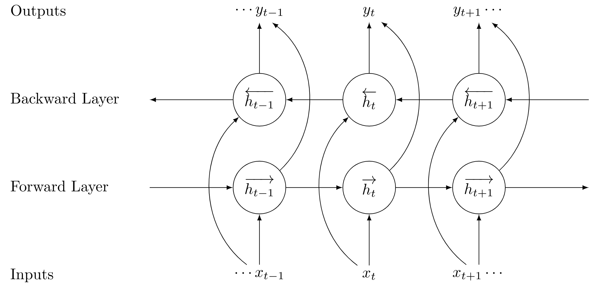

### Deep Learning Arcitecture

#### Architecture 1: 

Normal LSTM model


#### Architecture 2: 

LSTM model + Dense layer for Static features

#### Architecture 3: 

Attention-based LSTM model

#### Architecture 4:

Attention-based LSTM model + Attention-based Dense layer for Static features

### Custom Neural Network

#### LSTM

Use nomarl LSTM for outcome prediction


#### BiLSTM



```python
# Sequential model
# Forward layer
model = Sequential()
model.add(Bidirectional(LSTM(10, return_sequences=True), input_shape=(5, 10)))
model.add(Bidirectional(LSTM(10)))
model.add(Dense(5))
model.add(Activation('softmax'))
model.compile(loss='categorical_crossentropy', optimizer='rmsprop')

 # With custom backward layer
 model = Sequential()
 forward_layer = LSTM(10, return_sequences=True)
 backward_layer = LSTM(10, activation='relu', return_sequences=True,
                       go_backwards=True)
 model.add(Bidirectional(forward_layer, backward_layer=backward_layer,
                         input_shape=(5, 10)))
 model.add(Dense(5))
 model.add(Activation('softmax'))
 model.compile(loss='categorical_crossentropy', optimizer='rmsprop')
```

#### Attention Layer for Classification

Design your own attention layer:

```python
from keras import backend as K
class attention_layer(tf.keras.layers.Layer): 
    def __init__(self):    
        # Nothing special to be done here
        super(attention_layer, self).__init__()
        
    def build(self, input_shape):
        # Define the shape of the weights and bias in this layer
        # As we discussed the layer has just 1 lonely neuron
        # We discussed the shapes of the weights and bias earlier
        self.w=self.add_weight(shape=(256,1), initializer="normal")
        self.b=self.add_weight(shape=(19,1), initializer="zeros")
        super(attention_layer, self).build(input_shape)
        
    def call(self, x):
        # x is the input tensor of 256 dimensions
        # Below is the main processing done during training
        # K is the Keras Backend import
        e = K.tanh(K.dot(x,self.w)+self.b)
        a = K.softmax(e, axis=1)
        output = x*a
        
        # return the outputs. 'a' is the set of 19 attention weights
        # the second variable is the 'attention adjusted o/p state'
        return a, K.sum(output, axis=1)
```

Invoke attention layers:

```python
# lstm_out is o/p of step 3 and is an i/p to step 3.5
a, attn_adjusted_op = attention_layer()(lstm_out)
# attn_adjusted_op is o/p of step 3.5 and is an i/p to step 4
```
